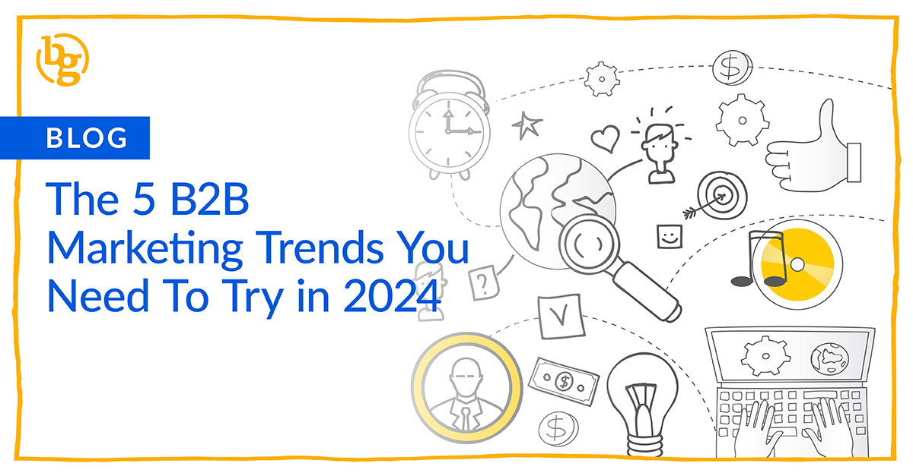

In the ever-evolving landscape of B2B marketing, 2024 is poised to be a year of transformation. Disruptions, amplified by factors like the pandemic and rapid technological advances, have reshaped how B2B buyers interact with vendors and how complex sales unfold. As marketers grapple with increasing pressure and constantly changing platforms, the quest for a distinctive value proposition that fosters brand trust and engagement becomes more critical than ever. We’ve compiled the top insights from our team of industry experts and beyond to reveal why these trends are guiding B2B marketers toward success in 2024.

### Trend #1: Video Content

Video content remains the undisputed champion of engagement, and we don’t see this disappearing any time soon. Throughout 2023, individuals dedicated an [average of 17 hours per week to viewing online videos](https://blog.hubspot.com/marketing/how-video-consumption-is-changing), and smart B2B marketers will continue, or begin, leveraging video content as a versatile and captivating medium to connect with their audience in 2024.

[Short-form videos](https://brandglue.com/blog/repurpose-video-content-social-media/), especially on platforms like Instagram and TikTok, emerge as the strategy of choice. With the average adult consuming dozens of hours of video content each month, brands need to optimize their video marketing strategies to cut through the digital noise. Educational series, behind-the-scenes peeks, and customer testimonials are great ways for B2B accounts to hop on this trend in an authentic way. 

### Trend #2: AI-Assisted Content

AI is not just a hot buzzword; it’s the powerhouse reshaping the marketing world. From predictive analytics to personalized recommendations and automated customer service, AI is truly a game-changer across all industries. Although many of us are still in the learning and exploration phase with this new technology, [those quick to embrace AI gain a definitive edge](https://www.forbes.com/sites/johnhall/2023/12/03/4-ways-b2b-brands-will-differentiate-themselves-in-2024/?sh=6196a1b4e33a). It's not just about using generative AI to create content but leveraging its ability to aid in predicting future trends, staying ahead of current trends, and finding areas of opportunity with impressive accuracy.

While there is a lot of fear around AI in the industry, this is a tool we should embrace rather than run from. The ability to aid in automation, efficiency, reporting, and more makes this a breakthrough that can not be ignored. Try putting the worry aside and implementing some AI tools today to help you streamline your B2B marketing process.

### Trend #3: User-Generated Content (UGC)

Authenticity is the currency of trust, and UGC is one of the best ways to build it into your marketing strategy. In 2024, we anticipate a surge in [user-generated content](https://www.wordstream.com/blog/b2b-marketing-trends-2024) as consumers place more trust in peer reviews and testimonials over brand-generated content. It makes perfect sense: we’re all more likely to purchase a product or sign up for a service if someone we recognize is in our feed explaining all the benefits rather than receiving the same message in a beautifully crafted graphic from a corporate marketing team. Building up a catalog of quality B2B UGC social media content - photos, videos, testimonials, and more from customers - will be a powerful tool for building trust and engagement within your social marketing efforts. 

### Trend #4: Interactive Content

It’s simple: if you give people the opportunity to connect with your business by crafting interactive content, they’re [twice as likely to engage](https://outgrow.co/blog/statistics-interactive-content). Not only does this benefit your engagement results, but it also increases your reach by up to 5x, because if more people are engaging with the content, the [algorithms want to show it](https://brandglue.com/blog/everything-about-linkedin-algorithm/) to more users. 

Whether you choose to use surveys, quizzes, calculators, or something else, this immersive approach leaves a lasting impression. Embracing interactive social media content in 2024 is an excellent way to foster customer loyalty, and is becoming a strategy that can’t be ignored.

### Trend #5: Conversational Content

Move beyond the often-stuffy industry jargon when it comes to social media; utilize common vocabulary and layman's terms in your posts to seem more “real” to your audience. It’s not just your average Joe who’s looking for genuine verbiage online: B2B buyers crave authentic interactions, too. 

Successful marketers will focus on building genuine relationships through conversational content that directly addresses their audience, making them feel valued and heard. It's about turning interactions into dialogues, where brands listen as much as they speak, fostering relationships through [meaningful conversations](https://brandglue.com/blog/b2b-social-media-dms/).

As we glide through 2024, these trends are not merely ideas to consider but are the keys to unlocking B2B marketing success this year. Together we can create a digital world where captivating video content, AI-driven insights, impressive UGC, interactive social experiences, and authentic conversations converge to shape a narrative that resonates with B2B decision-makers on profound levels. The path to success in 2024 isn't just about keeping up; it's about embracing these trends as we move toward a future where each engagement is a story waiting to be told.

