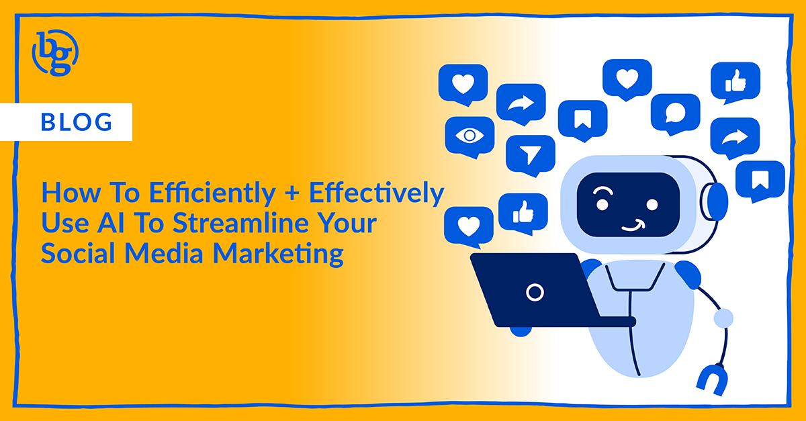

Let's face it: with ever-changing trends and constant platform updates, social media marketing can feel like a never-ending game of whack-a-mole. New techniques and tools pop up faster than you can say "#fail," while churning out engaging content week after week can leave you feeling like a hamster on a wheel. But fear not, weary social marketer!  The future is here, and it's powered by artificial intelligence (AI) that makes it easier than ever to streamline your social media marketing - if you know how to use it.

## AI: Your Social Media Sidekick, Not A Sentient Spreadsheet

Before you have visions of robots taking over your perfectly curated content calendar, relax. [AI in social media](https://www.marketingaiinstitute.com/blog/what-is-artificial-intelligence-for-social-media) marketing isn't about replacing you at all; it's about augmenting your skills so you can get more done in less time, allowing you to harness more creativity than ever before. From AI-assisted tools offering insights into best posting times to generative AI that can jumpstart copy creation, there is a wide array of ways to deploy AI to help you work more effectively. Think of it as your super-powered sidekick, freeing you from all those pesky, tedious tasks and fueling your creativity.

## How AI Is Upgrading Your Social Media Toolkit

Here's where things get interesting–you may already be using AI in your social media strategy without realizing it. From scheduling to designing to spell-checking, [AI](https://www.b12.io/resource-center/ai-how-to-guides/a-guide-to-using-ai-for-social-media-marketing.html) is being woven into the very fabric of top tools you’re already using in your social media management efforts. Let’s dig in to see just how deep artificial intelligence has permeated the social media landscape as of now.

### AI For Content Creation: From Brainstorming To Bliss

Feeling stuck in a content rut? AI can spark inspiration by generating content ideas, crafting catchy captions, and even suggesting relevant hashtags for your posts. Popular content scheduling tools like [Hootsuite](https://www.hootsuite.com/platform/owly-writer-ai), [Sprout Social](https://sproutsocial.com/ai/), and [Agorapulse](https://www.agorapulse.com/writing-assistant/) offer AI assistance in these areas, with built-in tools to help jumpstart your writing. Whether you don’t know where to start or just need a hand finishing up a caption, all of these tools (and more!) can offer options based on what you have drafted or even scan the contents of a landing page to start a draft for you based on where your post will link. 

You don’t have to be limited to using the AI within your social scheduling tools for this purpose. The original viral AI bot, [ChatGPT](https://openai.com/chatgpt), can be a great help for SMMs out there. Additionally, [Gemini](https://gemini.google.com/) from Google and [Copilot](https://www.microsoft.com/en-us/microsoft-copilot/) from Microsoft have upped their game and are great options to help with your social efforts. The prompts you feed into these tools are key - the more concise detail you can input, the better your output will be. If you prefer these options to the AI found within scheduling tools, here’s a tip: build a spreadsheet with tabs for each of your clients to store your best prompts for future use!

### Foresee Future Success With AI Scheduling

Thanks to AI, you never have to worry about knowing the perfect time to post ever again. [Buffer](https://buffer.com/ai-assistant), [Cloud Campaign](https://www.cloudcampaign.com/solutions/schedule), [Later](https://later.com/blog/caption-writer-for-instagram/), and practically every social media scheduling tool we know of is now using AI to suggest the best time to publish posts. But this isn’t just a generic suggestion - the AI within these tools assesses your past posts to make customized recommendations for your accounts. Start testing these post times and watch your engagement soar.

### Beyond Content: AI In Advertising & Reporting

The innovative marketers out there aren’t only using AI for content creation but in almost every facet of their work. They're using it to analyze audiences to hit the right users at the right time and even personalize content for specific user segments. Have you ever used an [Advantage+ audience](https://www.facebook.com/business/help/273363992030035?id=1629569087788063) in Meta’s Ads Manager or a [Predictive Audience](https://www.linkedin.com/help/lms/answer/a1631056) in LinkedIn’s Campaign Manager? Then you’re using AI to improve your results in these ways without even realizing it! 

## Embrace The AI Future

Currently, AI is in its early stages and is only going to become more embedded in our daily lives. No need to worry, though; AI isn't here to replace you, it's here to make you a social media marketing powerhouse. It’s a tool, and like any tool, it’s most effective when wielded by an expert marketer like yourself. So, ditch the busywork, [embrace the AI](https://www.hopperhq.com/blog/ai-in-social-media/) revolution, and watch your social media presence take flight!

