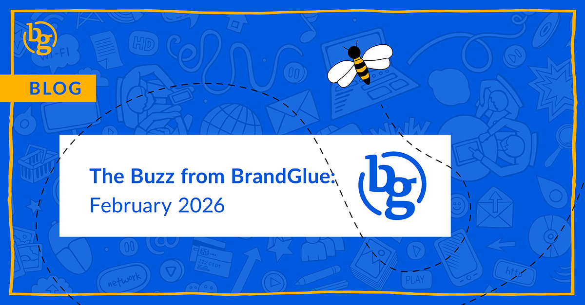

This blog summarizes the major social news and updates that took place in February 2026. From LinkedIn sharing how to optimize content for AI discovery to Manus AI getting launched in Meta Ads Manager to Instagram releasing content scheduling for all public profiles, it was another busy month in the social sphere. Read on to stay in-the-know.

### \> [Optimizing Owned Content for AI Discovery on LinkedIn](https://www.linkedin.com/business/marketing/blog/content-marketing/introducing-a-guide-to-optimizing-your-owned-content-for-ai-discovery)

Source: LinkedIn Marketing

We mentioned in January that LinkedIn was trailing only Reddit when it came to chatbot citations. It seems LinkedIn was paying attention to that trend as well. As search volume continues to drop and more B2B decision-makers use AI, the traditional “keyword-first” strategy is dead, according to LinkedIn’s Marketing Blog. The network has seen it firsthand, with B2B non-brand keyword traffic dropping up to 60%. If you need to adapt your content to be in a better position for AI Search, you can’t afford to miss this guide from LinkedIn.

### \> [LinkedIn Update on the Cracking Down of Engagement Pods](https://www.linkedin.com/posts/gyanda_back-with-a-friday-update-today-its-about-ugcPost-7427822230882979840-1CeC/)

Source: Gyanda Sachdeva, VP of Product at LinkedIn

In late 2025, we mentioned that user concerns about the continued influx of coordinated, non-genuine activity were continuing to rise on LinkedIn. And now, LinkedIn is using AI to make it harder to see anything it suspects of being an automated or coordinated attempt to boost a post’s engagement. These comments will be removed from the “Most Relevant” section of the post immediately and hidden in the “Most Recent” section, where it is much harder for users to find.

### \> [Manus AI Integration is Here for Meta Ads Manager](https://www.threads.com/@theahmedghanem/post/DUvqbCujK_G?xmt=AQF0raVuKYhePGcnvqf9nWoyO9e92nJZ9282U7WJROh3RA)

Source: Ahmed Ghanem, App Researcher

Manus AI is an AI company that was acquired by Meta in January, and they’ve wasted no time integrating it into Meta’s Ads Manager. One of the biggest benefits is the potential time saved when it comes to analyzing data and generating reports. These are typically time-consuming, and when you’re combing through lots of campaigns, it can be easy to miss something. Manus AI’s agents are supposedly built to focus on report-building and audience research, so it may be worth seeing if this adds more value than Meta’s previous AI offerings of generating images and videos. You can access Manus AI under the Tools listing in Ads Manager.

### \> [Content Scheduling Available to All Users on Instagram](https://www.instagram.com/p/DVO65fAEeh0/)

Source: Creators

Previously available for those who switched over to Professional Mode, creator tools are now accessible to all public accounts on the Instagram app. The idea here is to get more users to grow their platforms in the early stages and then have them graduate towards Professional Mode, where tools like Channels, IG Live, and Monetization are available. For those with smaller budgets, this at least opens up some new opportunities to test things out before making a bigger financial commitment.

### \> [Two New Aspect Ratio Options for X Ads](https://x.com/XBusiness/status/2027023344822837738)

Source: X Business

In an effort to give marketers additional options for their in-stream promotions, X has announced that it will now offer 4:5 format and 2:3 display within posts. While the expanded options are nice, the platform is pitching the convenience factor as it should enable advertisers to reuse their best-performing creatives from other networks without reformatting, cropping, or recreating new assets. Ad revenue is up about 10% YoY on X, but it still has a way to go to catch up to what it was generating in 2022.

### \> [Dear Algo Puts You in Control on Threads](https://about.fb.com/news/2026/02/threads-dear-algo/)

Source: Threads Newsroom

In a follow up to another story we’ve covered before, Threads is officially rolling out a revolutionary concept that might help us all stay on social media a little longer. Dear Algo is an AI-powered feature that lets you tell Threads which topics you temporarily want to see more or less of. You’re also able to repost someone else’s request and see if their preferences are ones that you like.

**That’s a wrap on the updates!**

Join us again next month as we continue to bring you the latest and greatest updates to help you succeed in the B2B social media marketing community. In the meantime, follow us on [LinkedIn](https://www.linkedin.com/company/brandglue-com/posts/?feedView=all) for additional updates.