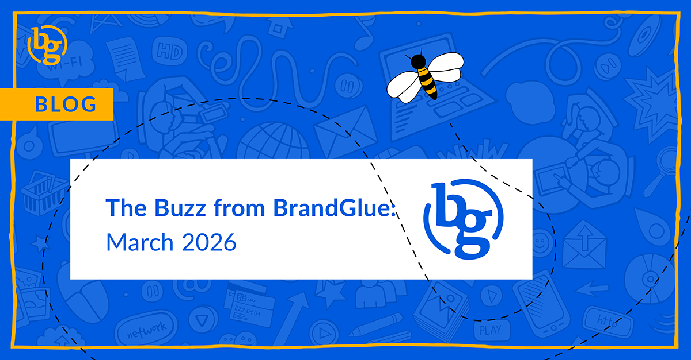

This blog summarizes the major social news and updates that took place in March 2026. From LinkedIn continuing to rank very highly for GEO search to a nice update to carousels on Instagram to an update to the Threads marketing API, it was another busy month in the social sphere. Read on to stay in-the-know. 

### \> [Leveraging LinkedIn for AI Visibility: A Detailed Guide](https://www.linkedin.com/business/marketing/blog/content-marketing/how-to-leverage-linkedin-for-ai-visibility-in-2026)

Source: LinkedIn Marketing

It seems that B2B buying continues to shift more towards prospects relying on AI-powered search to research products and create a shortlist. Third-party research from Semrush shows this is happening before users ever visit a company’s website. In January, we saw that LinkedIn only trailed Reddit in chatbot citations, but new data from Profound actually ranks LinkedIn as the most-cited domain for professional queries. This new checklist from VP Davang Shah can help you quickly adapt to these changes.

### \> [LinkedIn Live Isn’t So Live Anymore](https://www.linkedin.com/help/linkedin/answer/a554240)

Source: LinkedIn

Starting June 22, 2026, all LinkedIn Live events must be scheduled ahead of time. The network believes this will make the live events more discoverable and therefore more impactful for its members. Companies will no longer be able to go live spontaneously, but they can still do so on short notice by scheduling the event just a few minutes in advance.

### \> [The Latest on Meta Ads Targeting in 2026](https://www.jonloomer.com/meta-ads-targeting-2026/)

Source: Jon Loomer

These days, Meta’s targeting inputs fall into three categories: Audience Controls, Audience Suggestions, and Audience Restrictions. With Meta shifting more and more to algorithmic targeting, it’s important to have a full grasp of what each of these entails and whether or not what you’re doing is actually doing what you think it is. Advertising expert Jon Loomer looks at all of the various audience options, what the latest capabilities are, and shares the most up-to-date best practices when it comes to running Meta campaigns.

### \> [Much Anticipated Update to Carousels on Instagram](https://www.threads.com/@creators/post/DWO52_igL3r)

Source: Creators

You no longer have to quickly delete and then re-upload your carousel post if something is out of order. Instagram recently announced that users can now rearrange their slides within a carousel after publishing. This applies to both images and video displays. However, you won’t be able to add new media to the post. If you are looking to add something, you will still need to post a new carousel. This has been one of the platform’s most requested features, so it should certainly be well received.

### \> [Engagement on X Posts Is....Up?](https://buffer.com/resources/state-of-social-media-engagement-2026/)

Source: Buffer

According to a recent report that was based on tens of millions of posts sent via Buffer’s social media posting tool throughout 2025, engagement on X posts was significantly up. Engagement was defined as likes, replies, and shares in each social network’s app, ensuring that all engagement was measured the same way. While this is limited only to Buffer’s users, it is still interesting to see X posts seeing more action in 2025 than they were in 2024.

### \> [Threads Marketing API Update](https://developers.facebook.com/blog/post/2026/03/25/marketing-api-latest-updates-for-ads-on-threads/)

Source: Meta Developers

Following a recent update to the Threads Marketing API, partners and advertisers are now able to adopt new features and tools for enhanced campaign performance. The biggest addition comes in the form of App Ads now being supported. There is also a Reply Moderation Tooling available that gives the ability to view, hide, and reply to top-level comments on your Threads ads.

**That’s a wrap on the updates!**

Join us again next month as we continue to bring you the latest and greatest updates to help you succeed in the B2B social media marketing community. In the meantime, follow us on [LinkedIn](https://www.linkedin.com/company/brandglue-com/posts/?feedView=all) for additional updates.