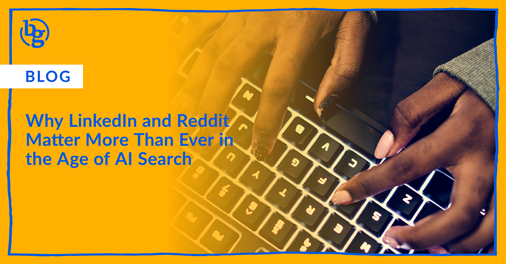

AI search is changing how people discover and evaluate brands, and social media is playing a bigger role than most marketers realize. As large language models (LLMs) pull from platforms like LinkedIn and Reddit to generate answers, B2B brands need to rethink how they show up beyond traditional SEO. This article breaks down what LLM visibility actually means and how consistent, high-quality social content is becoming a key driver of how your brand is understood in AI-powered search.

The recent explosion of GEO has been… a lot.

It’s exciting, a little confusing, and, if you’re a marketer, you’ve probably had at least one moment where you’ve thought, “Wait, are we doing SEO again but differently?”

A big part of that shift is the rise of LLMs, or large language models. These are AI systems that generate answers, summaries, and recommendations based on huge amounts of data across the internet. Instead of giving you a list of links, they give you a direct answer.

But here’s the part I don’t think we’re talking about enough: Those answers are increasingly shaped by social media.

Not just websites. Not just blogs. But real conversations, opinions, and content from platforms like LinkedIn and Reddit. So this isn’t just a search shift. It’s a social shift.

## Social media is becoming the training data

For a long time, social media was seen as mainly top-of-funnel. Good for awareness, engagement, and brand building. Now, it’s doing something very different. It’s becoming part of the dataset that AI uses to understand your brand.

When someone asks an LLM a question about your category, the answer isn’t just pulled from your website. It’s influenced by:

* What people are saying about you
* How often you show up in conversations
* The perspectives your team is putting out into the world

There are already strong signals that behavior is shifting fast. One report found that 37% of active AI users now start their searches with AI tools instead of traditional search engines. (Source: [SearchEngineLand](https://searchengineland.com/consumers-start-searches-ai-not-google-study-467159))

This means your audience is forming opinions about your brand before they ever land on your site. And a lot of that context is coming from social media platforms.

## Why LinkedIn is doing more heavy lifting than you think

If you’re in B2B, LinkedIn is probably the most important platform in this entire conversation. And we still see a lot of brands underutilizing it. We’re seeing LinkedIn content show up more and more in how AI tools summarize companies, industries, and trends. That includes posts, comments, and long-form articles. But the real power here isn’t just posting more. It’s what you’re posting.

Executive presence plays a huge role. When leaders consistently share actual perspectives, not just polished announcements, it creates strong signals around what your company stands for. Over time, those signals compound. LLMs start to associate your brand with specific ideas because they’ve seen it reinforced again and again.

And then there’s LinkedIn articles. They’re structured, topic-driven, and written in a way that AI can easily interpret. In a lot of ways, they’re one of the cleanest bridges between social content and search visibility right now. 

Also worth calling out, LinkedIn has a built-in trust advantage. Real identities, real experience, real credibility. That matters when AI models are deciding what to pull from. If your LinkedIn strategy is still mostly product updates and event recaps, you’re leaving a lot on the table.

## Reddit is influencing more LLMs than people realize

Reddit is a different story, but just as important. It’s messy, unfiltered, and not always brand-friendly. But that’s exactly why it works.

The platform sees around 80 million people using Reddit search every week (Source: [Search Engine Land](https://searchengineland.com/reddit-search-80-million-people-468598)), and it’s becoming a major input into how AI systems understand real-world questions and answers. When you look at AI-generated responses, Reddit shows up constantly. Not because it’s polished, but because it’s real.

People ask specific questions. Other people give detailed, experience-based answers. The community validates what’s helpful. That’s exactly the kind of content LLMs are designed to prioritize. 

For brands, this doesn’t mean jumping in and trying to control the narrative. That’s not how Reddit works, and it will backfire quickly. It means:

* Paying attention to how your category is being discussed
* Understanding the language your audience actually uses
* Contributing where it makes sense in a helpful, human way

Even if your brand isn’t directly mentioned, those conversations shape how AI systems interpret your space.

## How to actually tell if your LLM optimizations are working

Measurement is still catching up, but there are a few ways to start getting a real read on this now. The simplest place to start is to test it yourself. Prompt tools like ChatGPT, Perplexity AI, and Google Gemini with the kinds of questions your audience would actually ask. Then look at what comes back:

* Are you mentioned? 
* Are competitors showing up instead?\
  Is your brand associated with the right topics?

Beyond that, look for more concrete signals:

* Referral traffic from AI tools (when visible)
* Increases in branded search over time

You’re not looking for perfect attribution yet. You’re looking for patterns that show your brand is starting to show up and stick.

## Where this is going

We’re still early, which is the opportunity. Right now, social media is playing a much bigger role in discovery than most brands realize, not just for people, but for AI. LLMs are becoming the layer between your audience and the internet, and social content is a major input into that layer. Which means social isn’t just driving awareness anymore. It’s shaping how your brand is understood before anyone ever clicks through. And over time, that understanding is what compounds. The brands that show up consistently, with clear points of view, are the ones that get picked up, repeated, and reinforced.

If you want help shaping how your brand shows up in AI and social, contact us at [hello@brandglue.com](mailto:hello@brandglue.com).