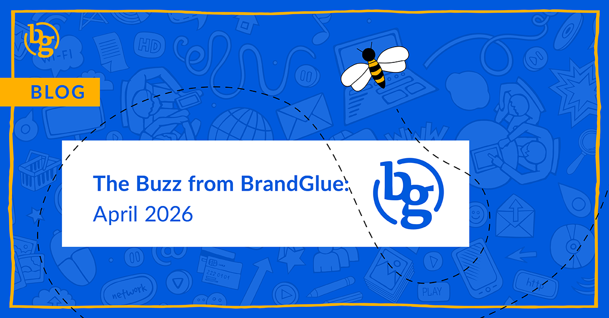

This blog summarizes the major social news and updates that took place in April 2026. From digital budgets shifting to Linkedin and away from search to Meta’s new “Describe your audience” feature to a cleaner desktop layout coming for Threads, it was another busy month in the social sphere. Read on to stay in-the-know. 

### \> [Document Posts on LinkedIn Are Still Seeing More Engagement](https://www.socialinsider.io/social-media-benchmarks/linkedin)

Source: SocialInsider

Socialinsider recently released a LinkedIn Benchmarks report that is based on 1.3 million posts from over 16,500 LinkedIn business pages with an active presence. Their data found that when uploading PDFs in a carousel format, they generated higher levels of engagement than video or image posts. For most social networks, video still remains king. But it seems that an eye-catching PDF, which usually features highlighted research and insights, will offer some new opportunities for organizations looking to grow their engagement.

### \> [Budgets Shifting to LinkedIn and Away From Search](https://www.linkedin.com/business/marketing/blog/research-and-insights/why-b2b-marketing-budgets-are-shifting-to-linkedin)

Source: LinkedIn

With search engines increasingly using AI to answer buyer questions directly on the results page, more companies are shifting their budgets away from non-branded search. According to recent research, buying committees now include an average of 10 stakeholders, 88 touch points occur before making a decision, and the purchase process takes an average of 272 days. Given this long cycle, it’s clear that the benefit for using social is that marketers can advertise to specific companies throughout the entire long-term buying cycle.

### \> [Meta’s New “Describe Your Audience” Feature](https://www.jonloomer.com/describe-your-audience-detailed-targeting/)

Source: Jon Loomer

We’ve seen a new AI feature for detailed targeting in Meta ads that replaces the traditional “include people who match” demographic box. You are now able to describe your ideal audience in 2,000 characters and then have Meta find a list of interests and behaviors that match your prompt. One of the nice things about this is that if you hover over an interest, Meta actually provides its reasoning as to why it believes it’s relevant to your ideal audience. It will be interesting to keep an eye on this to see if it makes any discernible difference in audience inputs or control.

### \> [New Ad Serving Process for Instagram](https://engineering.fb.com/2026/03/31/ml-applications/meta-adaptive-ranking-model-bending-the-inference-scaling-curve-to-serve-llm-scale-models-for-ads/)

Source: Meta Engineering

In an effort to better understand users’ interests and intent, Meta is scaling its Ads Recommender runtime models to LLM-scale and complexity thanks to its new Adaptive Ranking Model. It is touted as a replacement for the one-size-fits-all approach and dynamically aligns model complexity with an understanding of a person’s mindset. In layman's terms, this means that Instagram users should not just see more relevant ads, but that the delivery and experience should be much crisper due to these recent engineering enhancements.

### \> [X Eliminates Thousands of Bot Accounts](https://www.socialmediatoday.com/news/x-formerly-twitter-conducting-bot-purge-removal/817160/)

Source: Social Media Today

In an announcement that is long overdue, X announced that they recently conducted a major bot purge that saw them suspend 208 bot accounts per minute. These accounts seem to pop up as quickly as they’re squashed, making it a difficult ongoing project. The goal of improving platform authenticity and user trust is admirable, but social media managers concerned with metrics will likely see short-term dips in follower counts and other engagement metrics across the board.

### \> [Cleaner Desktop Layout Coming Soon for Threads?](https://www.threads.com/@conno_r/post/DXMxzBnDsjA)

Source: Connor Hayes (Head of Threads)

To make things easier for brands managing Threads, a cleaner desktop layout that includes messages is expected to start appearing on the desktop version of Threads. The platform has heard a lot of feedback on updating the threads dot com experience and sounds committed to investing more in the web experience moving forward.

**That’s a wrap on the updates!**

Join us again next month as we continue to bring you the latest and greatest updates to help you succeed in the B2B social media marketing community. In the meantime, follow us on [LinkedIn](https://www.linkedin.com/company/brandglue-com/posts/?feedView=all) for additional updates.